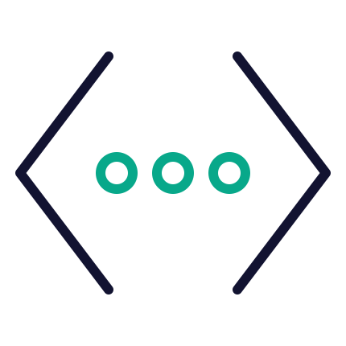

# 🚀 Mejora Code - El Consultor IT definitivo

Mejora Code es una plataforma interactiva diseñada para servir como **Cheat Sheet avanzada** y guía de referencia rápida para desarrolladores. Centraliza conceptos, ejemplos prácticos y documentación oficial de las tecnologías más demandadas en el ecosistema actual (Frontend, Backend y APIs).

 *Planificado: Insertar captura de pantalla real de la aplicación aquí*

---

## 🛠️ Tecnologías Cubiertas

La plataforma organiza el conocimiento en tres áreas principales:

- **Frontend**: JavaScript (ES6+), TypeScript, React, React Native, TanStack Query, Axios.
- **Backend**: Node.js, Express.js, SQL (Postgres), MongoDB.
- **APIs & Infra**: Supabase, REST Architecture, Postman/Insomnia logic.

---

## ✨ Características Principales

- **Búsqueda Inteligente**: Filtrado en tiempo real por nombre de concepto o descripción.
- **Niveles de Maestría**: Clasificación de contenido por niveles: Conceptos Básicos, Intermedio y Avanzado.
- **Code Playground**: Ejemplos de código listos para copiar con un solo clic.
- **Acceso Directo**: Enlaces directos a la documentación oficial de cada tecnología.
- **Diseño Premium**: Interfaz oscura (Glassmorphism) optimizada para el enfoque y la legibilidad.

---

## 🏗️ Arquitectura Técnica

El proyecto ha sido recientemente refactorizado para cumplir con estándares de alta calidad:

- **Core**: [React 18](https://react.dev/) + [Vite](https://vitejs.dev/).
- **Lenguaje**: [TypeScript](https://www.typescriptlang.org/) (Tipado estricto en toda la aplicación).
- **Lógica desacoplada**: Uso de *Custom Hooks* (`useMejoraSelection`) para separar la lógica de estado de la interfaz de usuario.
- **Estilos**: Vanilla CSS con variables personalizadas (Neon Theme).
- **Componentización**: Arquitectura modular con componentes reutilizables y atómicos.

---

## 🚀 Instalación y Desarrollo

Sigue estos pasos para ejecutar el proyecto localmente:

1.  **Clonar el repositorio:**
    ```bash
    git clone [url-del-repo]
    cd mejora-code
    ```

2.  **Instalar dependencias:**
    ```bash
    npm install
    ```

3.  **Iniciar servidor de desarrollo:**
    ```bash
    npm run dev
    ```

4.  **Verificar tipos (Check):**
    ```bash
    npx tsc --noEmit
    ```

---

## 📂 Estructura del Proyecto

```text
src/
├── components/     # Componentes de interfaz (Aside, Main, Card, etc.)
├── data/           # Repositorio central de conocimientos (data.ts)
├── hooks/          # Lógica de estado personalizada (useMejoraSelection)
├── interfaces/     # Definiciones de tipos TypeScript
├── styles/         # Definiciones de diseño y temas
└── utils/          # Funciones de utilidad (filtrado, etc.)
```

---

> [!TIP]
> Si quieres añadir una nueva tecnología o concepto, simplemente actualiza el archivo `src/data/data.ts` siguiendo las interfaces definidas en `src/interfaces/data.interfaces.ts`.

---

© 2025 **Edinson Devs** - Desarrollado para la mejora continua del código.
